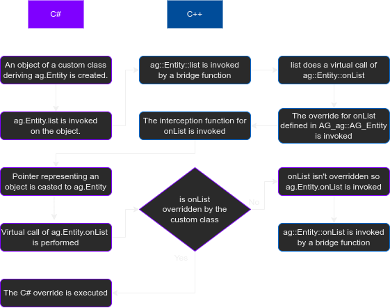

# Class Extension

Autoglue supports generating support code that allows for foreign languages to extend classes defined in the source language (e.g. Deriving a C++ class in C# and overriding its virtual functions).

## Extension Types

In order to support class extension, the glue code for a source language should define extension types for used classes. Extension types should be generated for the following reasons:

 - If a class is abstract in the source language, it cannot be instantiated if any interface function is left unimplemented. An extension type can implement these functions which makes the extension type instantiable.
 - In order to invoke overriding functionality defined in a foreign language, some context and callbacks have to be associated with the desired class. Extension types can store this information.

## Interception Functions

Autoglue provides support to generate interception functions to allow for a source language to invoke overriding functionality defined in a foreign language. An interception function is simply a static function that takes a pointer representing a foreign language object, through which a virtual call to the desired function can be made.

Interception functions are passed as C-compatible function pointers to a bridge function called `some_class_name_AG_initializeInterceptionContext`, which simply stores the passed callbacks and the foreign language object that will be passed to an interception function whenever they are invoked. **NOTE:** `some_class_name` just represents a class name and should actually indicate the full location of the given class, such as `ag_Entity_AG_InitializeInterceptionContext`.

## Invocation of overrides

For every generated overridable function, Autoglue generates support code that allows for a source language to invoke functionality defined in a foreign language. For example, calling `ag::Entity::list` leads to `ag::Entity::onList` being called. The following diagram explains what will happen when `ag::Entity::list` is called in C# through generated language bindings and how a custom override defined in a foreign language can be invoked.

[//]: # "TODO: Add a descriptive alt text"

In short, when a source language invokes an overridable function using an object created in a foreign language, there generally are two virtual calls:
1. The source language resolves the override defined in the extension function.
2. The foreign language resolves the final override which can be a generated function or a function override in a custom class.